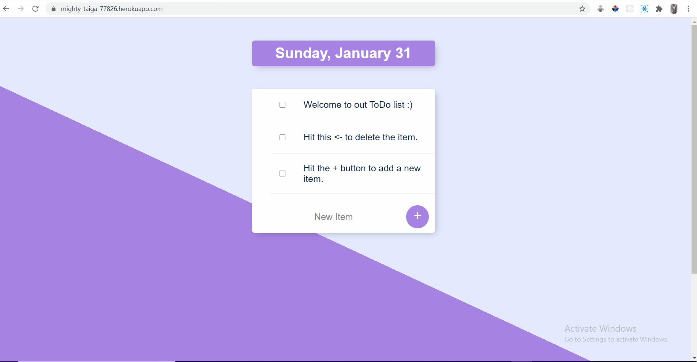

# ToDo 

ToDo is a simple web application with all its functionalities. I coded it while learning some Backend technologies with Angela Yu's Udemy full stack course.

## 💻 Build with

- Node.js
- Express
- EJS
- mongoDB
- mongoose

## 📷 Screen Shot

